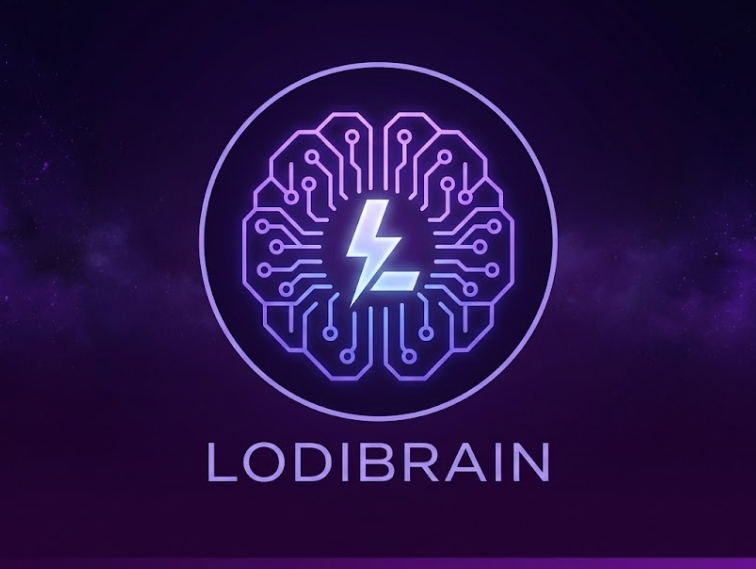

# LodiBrain v2.0 - IA de Elite



LodiBrain é um assistente virtual multimodal para Discord, desenvolvido em Python. Ele utiliza a inteligência da API do Google Gemini 1.5 Flash para fornecer respostas inteligentes e contextuais, além de utilitários essenciais para o servidor.

> Desenvolvido por: **LodiDEV** (Ezequiel Lodi)

## 🚀 Funcionalidades

* **Integração Gemini:** Respostas rápidas via API direta do Google.
* **Persistência de Contexto (Vault):** Salva o histórico de conversas em um banco de dados SQLite local.
* **Moderação:** Comando de limpeza rápida de chat (`!limpar`).
* **Estatísticas:** Consulta o volume de mensagens no banco de dados (`!stats`).
* **Menu de Ajuda:** Painel interativo com os comandos disponíveis (`!help`).

## ⚙️ Pré-requisitos

Antes de rodar o bot, você precisará:

1.  Python 3.8+ instalado.
2.  Uma conta de desenvolvedor no [Discord Developer Portal](https://discord.com/developers/applications) e o Token do seu Bot.
3.  Uma chave de API do [Google AI Studio (Gemini)](https://aistudio.google.com/).

## 🛠️ Instalação e Configuração

### 1. Clonar o Repositório
```bash
git clone [https://github.com/SEU_USUARIO/lodibrain.git](https://github.com/SEU_USUARIO/lodibrain.git)
cd lodibrain
